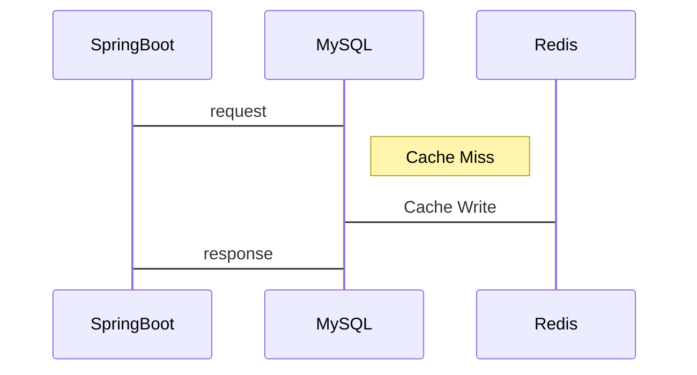
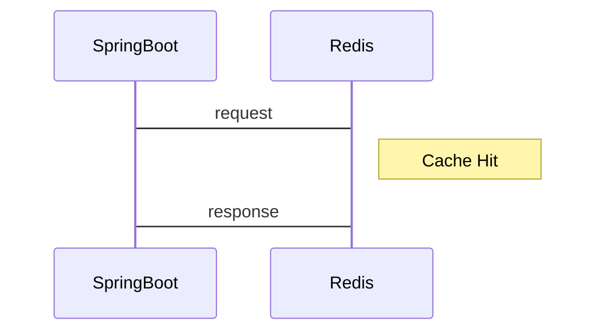

# Practical-use-of-Redis

## Hexagonal Architecture

## Redis 활용

### 0. Cache Aside Pattern

---

### Cache Miss

### Cache Hit

### 1. Bulk Loading

### 2. Distributed locks

---

## Stack

Java 17, Gradle, Redis, JPA, Mybatis

