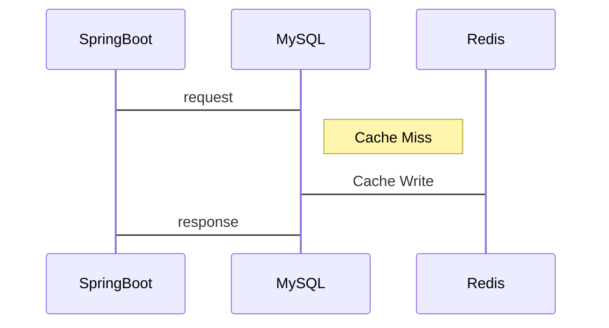
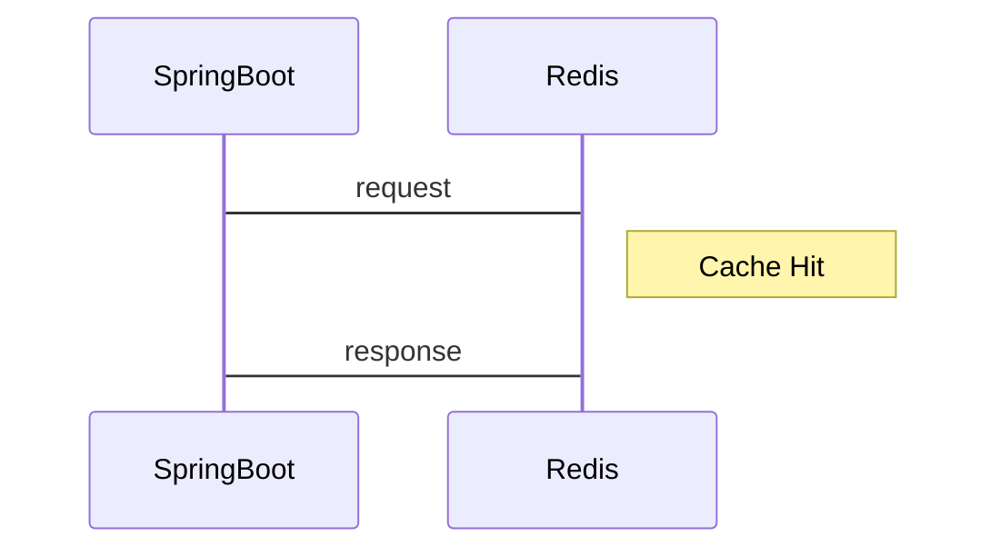

# Practical-use-of-Redis

## Hexagonal Architecture

### 장점:

1. 유연성: 외부 시스템이나 인프라와의 의존성을 낮추어, 구성 요소를 쉽게 교체하거나 업데이트할 수 있습니다.
2. 테스트 용이성: 비즈니스 로직을 독립적으로 테스트할 수 있어 품질 향상과 개발 속도 향상에 도움이 됩니다.
3. 유지보수성: 책임이 분리되어 있어, 코드의 이해와 수정이 용이하며, 변화에 빠르게 대응할 수 있습니다.

### 단점:

1. 구현 복잡성: 포트와 어댑터를 구성하고 관리하는 데 약간의 복잡성이 따릅니다.
2. 초반 개발 시간 증가: 아키텍처를 처음 구축할 때 시간과 노력이 더 필요할 수 있습니다.

---

## Redis 활용

레디스를 왜 깊게 알아야 할까 ??

- 웹 서비스 환경에서 시스템 성능 향상을 기대하고자함.
- RAM의 용량은 한정되있기 때문에 데이터를 어느 종류, 얼마나, 얼마동안 데이터를 캐시에 저장하는지에 대한 전략을 숙지할 필요가 있다. -> 단순 캐시 읽기, 쓰기 뿐만 아니라 레디스를 적용할 수 있는 범위가 늘어난다.

**개인적인 생각으로 앱과 데이터베이스 사이의 성능을 개선하기위해서 앱 내부 코드 수정또는 디비 튜닝등의 과정이 필요할 수 있다 이과정보다 쉽고 간단하게 성능을 개선하는 방법은 Redis를 우선 적용해본 상황이라 생각하기 떄문에 Redis까지 적용된 상황 속에서 그다음 성능을 끌어올리는 방법이 좋아보였다**

## Redis 활용 기능 및 사례

- OTP (One-Time-Password)
- 동시성 제어 (Distributed Lock)
- 요청제어 (유량 제어) (Rate Limiter) -> Sliding Window Rate Limiter vs Fixed Window Rate Limiter
- 활동 피드 (SNS Activity Feed)
- 장바구니
- 로그인 세션 관리
- 지도 상 위치간의 위 경도 계산 (Geofencing)
- 사용자 활동 상태 (Online Status)
- 방문자 수 카운트 (Visitors Count)
- 아이템 중복요청 처리 (Unique Events)

## Redis 사용 시 유의할 점

- O(N) 명령어 사용 자제 -> KEYS, SMEMBERS, HGETALL, SORT
- Thundering Herd Problem
- Stale Cache Invalidation

## Cache warm-up, Cache warming

**Cache warm-up or Cache warming** : 미리 Cache로 데이터베이스의 데이터를 밀어 넣어두는 작업을 의미합니다. 이 작업을 수행하지 않는다면 서비스 초반, 트래픽 급증 시 발생하는 대량의 Cache miss + Cacheable 작업으로 인해 Cache와 데이터베이스의 부하가 급증하는 **Thundering Herd**가 발생할 수 있습니다.

물론 warm-up을 통해 추가되었던 Cache가 expire 된다면 다시 Thundering Herd가 발생할 여지가 있으므로 이를 원천적으로 해결하기 위해서는 Probabilistic Early Recomputation 방식 등과 같이 Cache의 TTL이 만료되기 전에 갱신시키는 방법 등을 고려하여야 합니다.

**Thundering Herd**는 모든 지점에서 발생되는 것은 아니며, 서비스의 첫 페이지와 같은 대부분의 조회가 몰리는 지점에서 주로 발생됩니다.

## Read Cache Strategy

### 1. Cache Aside Pattern (Read Through(Inline-Cache))

---

서비스에 사용자 조회 요청이 들어오면 Cache를 조회하고 Cache miss가 났을 때 데이터베이스에 저장된 데이터를 조회하여 Cache를 업데이트한 뒤 값을 반환하는 전략입니다. 

### Cache Miss

### Cache Hit

 ** 초반 Cache 성능 향상 및 트래픽 급증 대비를 위해 (Cache miss 감소) cache warm up을 수행하는 것이 좋습니다.

이 방식은 직접적인 데이터베이스 접근을 최소화하고 Read에 대한 소모되는 Resource를 최소화할 수 있습니다. 하지만 Cache에 장애가 발생하였을 경우 이는 바로 서비스 전체 중단으로 빠질 수 있습니다. 그렇기에 Cache를 제공하는 Redis과 같은 구성 요소를 Replication 또는 Cluster로 구성하여 가용성을 높여야 합니다.

### 2. Look Aside Cache

---

서비스에 사용자 조회 요청이 들어오면 우선 Cache에 저장된 데이터가 있는지 확인하는 전략입니다.

 ** 이 방식 또한 서비스 운영 초반에 cache warm up을 수행하는 것이 좋습니다.

이 방식은 Cache에 장애가 발생하더라도 데이터베이스에 요청을 전달함으로써 Cache 장애로 인한 서비스 중단 발생을 대비할 수 있습니다. 하지만 조회 요청이 많을 경우 Cache에서 발생한 장애가 데이터베이스로 전파되어 전체 장애가 발생할 수 있습니다.

## **Write Cache Strategy**

### 1. **Write Around**

데이터베이스에 데이터를 저장하고 Cache miss가 발생했을 때 Cache로 데이터를 가져오는 쓰기 전략입니다. 이는 Look aside cache의 Cache miss 발생 시 흐름을 이야기합니다.

Cache miss가 발생하기 전에 데이터베이스에 저장된 데이터가 수정되었을 때, 사용자가 조회하는 Cache와 데이터베이스 간의 데이터 불일치가 발생하게 됩니다.

데이터 불일치를 방지하기 위해서는 데이터베이스에 저장된 데이터가 수정, 삭제될 때마다 저장해둔 Cache 또한 삭제하거나 변경해야 하며 데이터 수정 사항이 빈번할 수록 Cache의 expire를 짧게 조정하는 식으로 대처하여야 합니다. 

데이터 수정, 삭제 요청이 너무 빈번한 경우 Cache를 변경하거나 삭제하는 비용이 조회하는 비용보다 커지게 될 수 있기 때문에 잘 고려하여 적용하여야 합니다.

### 2. **Write Through**

데이터베이스와 Cache에 동시에 데이터를 저장하는 전략입니다. 이 방법은 Write Around 전략에서 발생하는 데이터 불일치 문제가 발생하지 않지만 (Cache에도 계속 최신의 데이터가 반영되기 때문에) 매 요청마다 2번의 Write가 발생하게 됨으로써 빈번한 생성, 수정이 발생하는 서비스 영역에서는 성능 이슈(부하)가 가중될 수 있습니다.

이 전략을 Read through 전략과 결합하여 사용한다면 최신 데이터 보장을 통해 Cache의 수정이나 변경을 하지 않으면서도 안정적으로 Read Through 전략의 이점을 끌어올릴 수 있습니다.

### 3. **Write Back**

Cache에 데이터를 저장, 반영하고 일정 주기(스케줄링)의 배치 작업을 통해 데이터를 데이터베이스에 반영하는 전략입니다. 

이 방법은 Write가 빈번하면서 Read를 하는데 많은 양의 Resource가 소모되는 서비스 영역의 경우 (data set이 큰 경우) 적용해볼 수 있는 방법입니다. (데이터베이스를 조회하지 않고 지속적인 접근이 가능하도록 합니다.)
데이터의 불일치나 조회 요청으로 인한 서비스 부하는 발생하지 않으나, In-memory에 데이터가 일정 기간 저장되기 때문에 장애가 발생하였을 때 데이터 손실이 발생할 수 있습니다.

이 또한 Replication이나 Cluster 구조를 적용함으로써 Cache 서비스의 가용성을 높여야만 합니다.

이 전략을 통해 새로운 데이터를 추가하거나 변경하는 성능을 끌어올릴 수 있고 또한 읽어오는 데이터의 크기를 의식하지 않을 수 있습니다. 부가적으로 데이터베이스 장애가 발생하더라도 지속적인 서비스를 제공할 수 있도록 보장합니다.

## Cache Strategy Pattern

위 설명한 Read, Write 전략을 기준으로 앱의 서비스에 따른 상황을 고려하여 조합을 선택할 수 있다.

1. Cache Read + Write 조합
   1. Look Aside + Write Around
      - 가장 일반적으로 자주 쓰이는 조합
   2. Read Through + Write Around
      - 항상 DB에 쓰고, 캐시에서 읽을때 항상 DB에서 먼저 읽기 때문에 데이터 정합성 유지
   3. Read Through + Write Through
      - 데이터를 쓸때 항상 캐시에 먼저 쓰기 때문에 읽을때 항상 최신의 캐시 데이터 저장
      - 데이터를 쓸 때 항상 캐시에서 DB로 보내므로 정합성 보장

## ETC

---

### 1. Bulk Loading

### 2. Distributed locks

---

## Stack

Java 17, Gradle, Redis, JPA, Mybatis

### Reference

- https://lob-dev.tistory.com/77 - Redis Cache Strategy
- https://velog.io/@hongjunland/%EC%BA%90%EC%8B%9C-%EC%84%A4%EA%B3%84-%EC%A0%84%EB%9E%B5 - 캐시 설계 전략
- https://mangkyu.tistory.com/311 - Redis 분산락의 필요성과 한계
- https://redis.io/docs/latest/develop/use/patterns/bulk-loading/ - Redis Bulk-Loading

